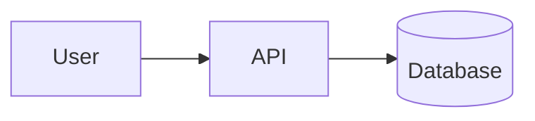

# Markdown Mermaid Viewer

A Markdown reader in a single HTML file. It renders your `.md` documents as clean, readable pages, and turns ```` ```mermaid ```` code blocks into diagrams you can zoom, pan, pop out and view full screen.

No install, no build, no server: download one file and open it in your browser.

## Getting started

1. Download [`Markdown_Mermaid_Viewer.html`](Markdown_Mermaid_Viewer.html).
2. Open it in your browser (double-click it, or drag it onto a browser window).
3. Open a document:
   - **open file**: a single `.md` file.
   - **open folder**: a whole folder of docs, which makes relative links and images work (see [Folders](#folders-relative-links-and-images)).
   - **Drag and drop** a file or a folder anywhere on the page.
   - **paste text**: paste Markdown straight in.
   - **load example**: a sample document to try the features.

Chrome or Edge is recommended. The viewer works in other browsers too, with a few limits listed under [Browser support](#browser-support).

An internet connection is needed on first load: the page gets its Markdown and diagram libraries (marked, mermaid) from cdnjs and its fonts from Google Fonts. Your documents are never uploaded anywhere; they're read locally by your browser.

## Reading

- **Table of contents**: documents with two or more headings get a contents list. On wide screens it's a sidebar on the left; on narrow screens it's a panel that slides out. The **☰ contents** button shows or hides it. The section you're reading is highlighted, and clicking an entry jumps straight to it.
- **Top bar**: hides as you scroll down and comes back as soon as you scroll up.
- **Theme**: light by default. Click **◐** to switch between light and dark; your choice is remembered.
- **Links**: links to headings in the same document (`[Setup](#setup)`) jump to that heading, using the same heading anchors as GitHub. Links to websites open in a new tab.

## Diagrams

Any code block marked `mermaid` is drawn as a diagram:

````markdown

````

Every diagram gets a small toolbar:

| Control | What it does |
| --- | --- |
| **−** / **+** | Zoom out / in. The percentage shows the current zoom. |
| **fit** | Reset to the fitted size (100%). |
| **⧉** | Open the diagram in a large popup over the page. |
| **⤢** | View the diagram full screen. Press **⤢** again or **Esc** to exit. |

- At 100% a diagram fills the width of the page.
- **Zoom**: hold **Ctrl** (or **⌘** on Mac) and scroll over a diagram, or pinch on a trackpad. Plain scrolling scrolls the page. In the popup and in full screen, plain scrolling zooms.
- **Pan**: click and drag the diagram.
- **Close the popup** with **✕**, by clicking outside it, or with **Esc**.

If a diagram has a syntax error, the viewer shows mermaid's error message in its place.

## Folders, relative links and images

When you open a single file, the browser gives the viewer the file's contents but not the folder it came from. Links to other files (`docs/setup.md`, `../README.md`) and relative images (`images/diagram.png`) therefore can't be found.

To make them work, open the **folder** instead, with **open folder** or by dragging the folder onto the page. The viewer then:

- starts on `README.md` or `index.md` if the folder has one;
- lists every Markdown file in the folder in a dropdown in the top bar;
- opens linked `.md` files inside the viewer, including links to a heading (`setup.md#install`). The browser's **Back** and **Forward** buttons move between documents you've visited;
- shows relative images from the folder;
- opens other linked files (PDFs, source files…) in a new tab.

`.git` and `node_modules` folders are skipped.

## Reload

The **↻** button next to the file name reads the current document from disk again, so you can see your edits without reopening the file. Your scroll position is kept. In a folder, it stays on the document you're viewing and also picks up files that were added.

In Chrome and Edge the first reload may ask you to allow the page to read the file.

## Recently opened

Files and folders you open are remembered, so you can get back to the last document you were reading in one click:

- **continue reading** on the start page, and the **recent ▾** menu in the top bar.
- Reopening an entry brings you back to where you left off: the same scroll position and, for a folder, the same document.
- **✕** removes an entry; **clear list** removes all of them.

In Chrome and Edge, entries reopen the actual file or folder, so you always see its latest version. After a browser restart you'll be asked to allow access again, which takes one click. In other browsers a file is kept as a **copy** of its text at the time you opened it, so later edits won't show until you open the file again.

## Keyboard

| Key | Action |
| --- | --- |
| **Esc** | Close the popup, full screen, the contents panel, the recent menu or the paste panel. |
| **Ctrl / ⌘ + scroll** | Zoom a diagram. |

## Browser support

| Feature | Chrome / Edge | Firefox / Safari |
| --- | --- | --- |
| Reading, table of contents, diagrams, themes | ✓ | ✓ |
| Open folder, relative links and images | ✓ | ✓ |
| **↻** reload after the file changed on disk | ✓ | May fail; open the file again |
| Recent files reopen the live file | ✓ | Saved copy only |
| Recent folders | ✓ | Not remembered |
| Full screen diagrams | ✓ | ✓ (fills the window on iPhone) |

The "Recently opened" list and your theme choice are stored in your browser only. They aren't shared between browsers or devices.

## License

See [LICENSE](LICENSE).
